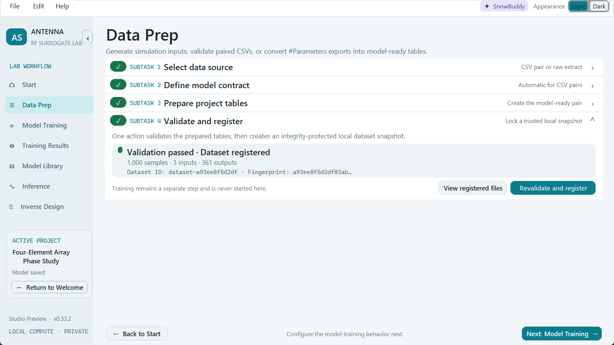
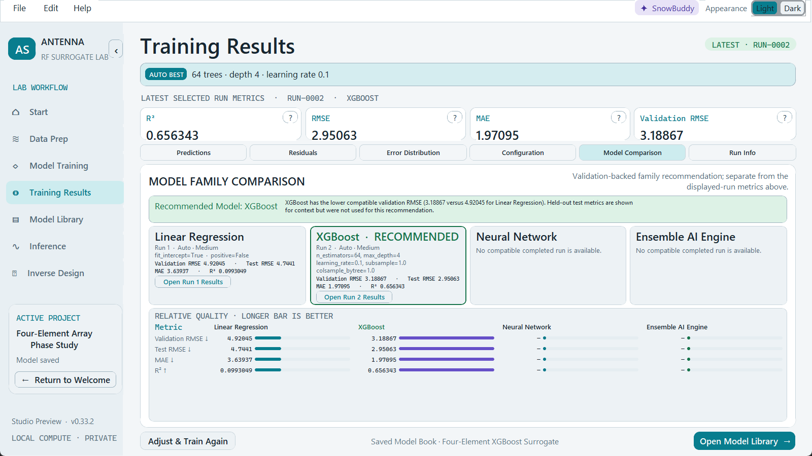
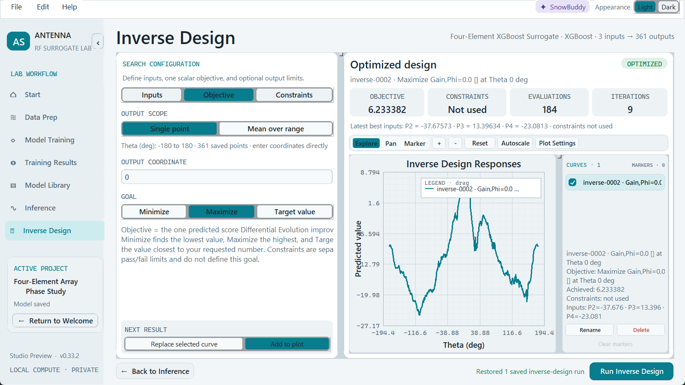
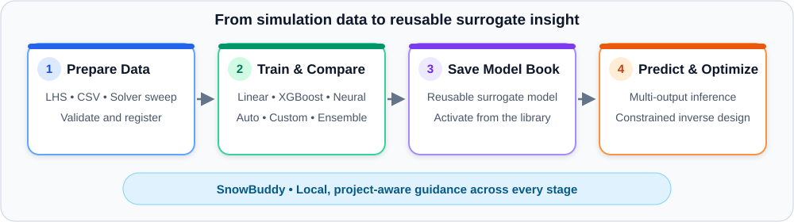

# Antenna Surrogate Studio

Antenna Surrogate Studio is a local desktop application for turning simulation
data into reusable surrogate models, exploring predictions, and running inverse
design studies.

## Data → Surrogate Training → Inverse Design

<table>
  <tr>
    <td width="33%">
      <a href="docs/screenshots/01-data-preparation.png">
        
      </a>
    </td>
    <td width="33%">
      <a href="docs/screenshots/02-model-comparison.png">
        
      </a>
    </td>
    <td width="33%">
      <a href="docs/screenshots/03-inverse-design.png">
        
      </a>
    </td>
  </tr>
  <tr>
    <td align="center"><strong>1 · Prepare and validate data</strong></td>
    <td align="center"><strong>2 · Train and compare surrogates</strong></td>
    <td align="center"><strong>3 · Search and inspect designs</strong></td>
  </tr>
</table>

<p align="center"><em>Shown with the included four-element patch-array phase-sweep sample. Select an image to view it full size.</em></p>

Everything runs on your computer. Your projects, models, results, and SnowBuddy
conversations remain in your local project folders.

## What it does

- Latin Hypercube sample generation
- Dataset preparation and validation
- Linear Regression, XGBoost, and Neural Network models
- Auto and Custom training
- Ensemble AI Engine
- Model comparison
- Reusable Model Books
- Multi-output inference and scientific plotting
- Surrogate-driven inverse design with constraints



## Install and launch

### Windows 10 or 11

You need a 64-bit installation of Python 3.11, 3.12, or 3.13.

1. [Download the repository as a ZIP](https://github.com/sampreethsharma7/AntennaSurrogateStudio/archive/refs/heads/main.zip) and extract it, or clone the repository.
2. Open the extracted `AntennaSurrogateStudio` folder.
3. Double-click **Start Antenna Surrogate Studio.bat**.

The first launch creates one private `.venv` environment and installs the
required packages. The Studio opens automatically when setup finishes.

For every later launch, double-click **Start Antenna Surrogate Studio.bat**
again. The same environment is reused; you do not need to activate it or create
another one.

### macOS or Linux

You need 64-bit Python 3.11, 3.12, or 3.13. Open a terminal in the repository
folder and run:

```bash
bash start_studio.sh
```

On Linux, install your distribution's Python Tk package first if it is missing
(commonly `python3-tk`).

For command-line setup, troubleshooting, and system requirements, see
[INSTALL.md](INSTALL.md).

## Start your first project

1. Select **Create Project**.
2. In **Data Prep**, load an input/output CSV pair or parse a supported parameter-sweep export.
3. Select **Validate and register**.
4. Open **Model Training**, choose a model and training mode, then select **Train Model**.
5. Review the completed run in **Training Results**.
6. Select **Create Model Book** to save the trained surrogate for reuse.
7. Make the Model Book active in **Model Library**.
8. Use **Inference** for new predictions or **Inverse Design** to search for suitable inputs.

For detailed, page-by-page operating instructions, see the
[Antenna Surrogate Studio User Manual](USER_MANUAL.md).

## Try the included sample

The repository includes a ready-to-use
[four-element patch-array phase-sweep sample](sample_data/four_element_patch_array_phase_sweep/).
It contains 1,000 CST parameter-sweep cases and a 361-point radiation pattern
for each case.


To try it, create a project and choose **#Parameters sweep** in **Data Prep**.
Browse to the sample's `data` folder, select **Parse**, then choose `P2`, `P3`,
and `P4` as the model inputs and `Gain,Phi=0.0 []` as the output. Select
**Save selection**, **Prepare input + output**, and **Validate and register**.

For exact steps and a suggested first training run, open the
[sample guide](sample_data/four_element_patch_array_phase_sweep/README.md).

## Optional SnowBuddy local AI

SnowBuddy's built-in workflow guidance works without any additional service.
For local conversational AI, install [Ollama](https://ollama.com/download),
start it, and choose a model from **SnowBuddy > Local model**:

- `qwen3:1.7b` for lower-resource computers.
- `qwen3:8b` for computers with about 16 GB RAM or more.

Ollama is optional. No OpenAI API key or paid cloud account is required.

## Projects and privacy

Projects are stored by default in:

```text
Documents/Antenna Surrogate Studio Library/projects/
```

To move a project to another computer, copy the complete project folder. Do not
copy only the model file; the folder also contains the project state, Model
Books, prediction and inverse-design histories, and local SnowBuddy history.

The Studio does not upload project data or conversations.

## Help and contact

- Setup help: [INSTALL.md](INSTALL.md)
- User instructions: [USER_MANUAL.md](USER_MANUAL.md)
- Author: **Sai Sampreeth Indharapu**
- Email: [sampreethsharma@gmail.com](mailto:sampreethsharma@gmail.com)
- LinkedIn: [Sai Sampreeth Indharapu, Ph.D.](https://www.linkedin.com/in/sai-sampreeth-indharapu-ph-d-a98802110/)

## Repository policy

This repository is an author-maintained software release. External pull
requests and code contributions are not accepted. For installation help or
tester feedback, contact the author directly.

## License

Copyright © 2026 Sai Sampreeth Indharapu. All rights reserved. See
[LICENSE](LICENSE).
