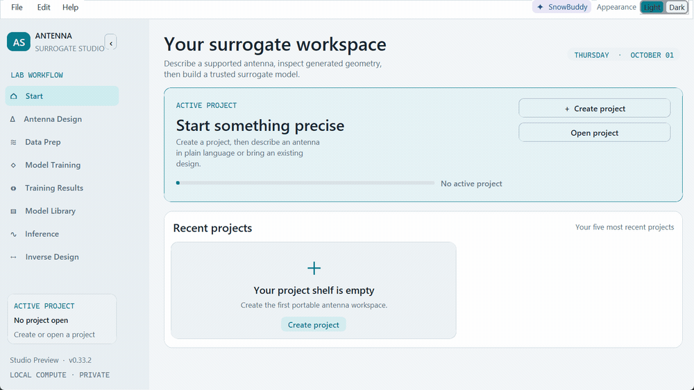

# Antenna Surrogate Studio

**Studio Preview v0.34.0-beta.** Source-available for noncommercial use; see
[License](#license).

Antenna Surrogate Studio is a local desktop application for antenna engineers
and researchers who want to turn electromagnetic simulation data into reusable
machine-learning surrogate models. You prepare a dataset from a parameter sweep,
train and compare surrogates, use them for fast prediction, and run inverse
design to search for the inputs that meet a target response — all on your own
computer, against your own data. Alongside that pipeline it ships an
**experimental** text-driven antenna geometry builder, which turns plain-language
requests into a parameterised CST model seeded from one of three validated
antenna recipes.

The two halves are at very different maturity levels, and this README keeps them
apart deliberately. The surrogate-modelling pipeline is the stable part. The
antenna agent is a beta feature whose output you are expected to inspect and
simulate before trusting it.

## Data → Surrogate Training → Inverse Design

<table>
  <tr>
    <td width="33%">
      <a href="docs/screenshots/01-data-preparation.png">
        
      </a>
    </td>
    <td width="33%">
      <a href="docs/screenshots/02-model-comparison.png">
        
      </a>
    </td>
    <td width="33%">
      <a href="docs/screenshots/03-inverse-design.png">
        
      </a>
    </td>
  </tr>
  <tr>
    <td align="center"><strong>1 · Prepare and validate data</strong></td>
    <td align="center"><strong>2 · Train and compare surrogates</strong></td>
    <td align="center"><strong>3 · Search and inspect designs</strong></td>
  </tr>
</table>

<p align="center"><em>Shown with the included four-element patch-array phase-sweep sample. Select an image to view it full size.</em></p>

Everything runs on your computer. Your projects, models, results, and SnowBuddy
conversations remain in your local project folders.

## What it does

### Surrogate modelling — the stable half

- Dataset preparation and validation from input/output CSV pairs or a supported
  parameter-sweep export
- Latin Hypercube sample generation, to produce the simulation inputs in the
  first place
- Linear Regression, XGBoost and Neural Network models, with Auto and Custom
  training modes
- Ensemble AI Engine and side-by-side model comparison
- Reusable **Model Books**, so a trained surrogate can be reloaded and shared
  between projects
- Multi-output inference with scientific plotting
- Surrogate-driven inverse design with constraints

### Experimental antenna geometry builder — beta

- Text-driven construction seeded from three validated antenna recipes, with
  compositional editing of the resulting geometry
- Interactive in-app 3D preview of the evaluated geometry
- Parameterised CST export, and direct native `.cst` project creation on Windows
- Read-only analytical checks (patch and dipole baselines, array spacing)
- One-click transfer of chosen parameters into the LHS sample generator

See [The experimental antenna agent](#the-experimental-antenna-agent-beta) for
what it can and cannot do today.


## Install and launch

### Windows 10 or 11

You need a 64-bit installation of Python 3.11, 3.12, or 3.13.

1. [Download the repository as a ZIP](https://github.com/sampreethsharma7/AntennaSurrogateStudio/archive/refs/heads/main.zip) and extract it, or clone the repository.
2. Open the extracted `AntennaSurrogateStudio` folder.
3. Double-click **Start Antenna Surrogate Studio.bat**.

The first launch creates one private `.venv` environment and installs the
required packages. The Studio opens automatically when setup finishes.

For every later launch, double-click **Start Antenna Surrogate Studio.bat**
again. The same environment is reused; you do not need to activate it or create
another one.

### macOS or Linux

You need 64-bit Python 3.11, 3.12, or 3.13. Open a terminal in the repository
folder and run:

```bash
bash start_studio.sh
```

On Linux, install your distribution's Python Tk package first if it is missing
(commonly `python3-tk`).

For command-line setup, troubleshooting, and system requirements, see
[INSTALL.md](INSTALL.md).

## Start your first project

1. Select **Create Project**.
2. In **Antenna Design**, continue with an existing design or open the experimental antenna design agent.
3. In **Data Prep**, load an input/output CSV pair, parse a supported parameter-sweep export, or receive selected builder parameters in the LHS generator.
4. Select **Validate and register**.
5. Open **Model Training**, choose a model and training mode, then select **Train Model**.
6. Review the completed run in **Training Results**.
7. Select **Create Model Book** to save the trained surrogate for reuse.
8. Make the Model Book active in **Model Library**.
9. Use **Inference** for new predictions or **Inverse Design** to search for suitable inputs.

## Try the included sample

The repository includes a ready-to-use
[four-element patch-array phase-sweep sample](sample_data/four_element_patch_array_phase_sweep/).
It contains 1,000 CST parameter-sweep cases and a 361-point radiation pattern
for each case.


To try it, create a project and choose **#Parameters sweep** in **Data Prep**.
Browse to the sample's `data` folder, select **Parse**, then choose `P2`, `P3`,
and `P4` as the model inputs and `Gain,Phi=0.0 []` as the output. Select
**Save selection**, **Prepare input + output**, and **Validate and register**.

That one output is a radiation pattern, so preparation expands it into 361
columns — one per theta point — and the surrogate you train predicts the whole
pattern at once rather than a single number.

For exact steps and a suggested first training run, open the
[sample guide](sample_data/four_element_patch_array_phase_sweep/README.md).

## The experimental antenna agent (beta)

<div align="center">



<sub>Patch → slot → array → CST, from three sentences.</sub>

**[See the full Text-to-CAD showcase →](TEXT_TO_CAD.md)**

</div>

### What it is

The agent is **recipe-seeded, not free-form**. It is not a general text-to-CAD
system, and it will not invent an antenna topology from a description. Every
design begins by selecting one of three validated recipes, after which you edit
the result — in language or directly in the parameter table:

| Recipe | Notes |
| --- | --- |
| Inset-fed rectangular microstrip patch | Also accepts four subtractive circular corner cutouts, centred on the patch corners, with a parametric radius ratio defaulting to one quarter of the patch width |
| Probe-fed circular patch | |
| Centre-fed dipole | |

Where geometrically valid, each element can be replicated into a 1×N linear or
M×N planar array. Array elements receive independent ports; **the builder does
not synthesise an array feed network.**

On top of that seed sits genuine compositional editing. A small set of
planner-exposed primitives can create named parameters, build rectangular and
circular cutting geometry, translate, rotate and duplicate the shapes it just
made, and apply validated union and subtraction operations. That is how a
slot ends up in a patch without a slot-specific feature existing. Successful
compositions are stored with the project and **replayed** against semantic
antenna-element targets after later recipe or table edits, so changing the
frequency does not discard your slot. If a replay is no longer geometrically
compatible, the edit is rejected and the last valid design stays open.

### The capability boundary

With a design open, the planner may call **19 registered tools** and nothing
else:

- **6 recipe and modifier actions** — `design.reset`, `recipe.select`,
  `parameter.set`, `excitation.set_strategy`, `modifier.apply`,
  `modifier.remove`
- **9 composition primitives** — `parameter.create`,
  `geometry.rectangle_sheet`, `geometry.cylinder`, `geometry.circle_sheet`,
  `geometry.translate`, `geometry.rotate`, `geometry.duplicate`,
  `boolean.subtract`, `boolean.union`
- **4 read-only analysis tools** — `engineering.design_summary`,
  `engineering.array_spacing`, `engineering.rectangular_patch_baseline`,
  `engineering.dipole_baseline`

The model's only permitted replies are an ordered sequence of those registered
calls, one clarification question, or a refusal. It cannot add tools, geometry
types, antenna families, materials or solver commands, and it never emits CST
code. A deterministic executor validates schemas, object references, bounds,
dependencies and the complete resulting design before anything is published; the
parameter table, 3D preview, CST adapter and LHS transfer all read that one
validated design graph. Unsupported antenna families, cross-family parameters,
invented geometry targets and arbitrary CST operations are rejected without
altering the design you already have.

### What you are responsible for

> **This is a starting-geometry generator, not an antenna synthesis or
> optimisation system.** The analytical dimensions and the 3D preview are design
> aids. Nothing here solves Maxwell's equations.
>
> Before you trust a generated model, open it and check the materials, feeds,
> ports, boundaries and mesh, then simulate it. Agreement with an analytical
> baseline does not establish resonance, impedance match, gain, bandwidth,
> efficiency or pattern validity.

Read [Current limitations](docs/LIMITATIONS.md) before your first export — in
particular the note on element spacing, which decides whether sweeping frequency
also moves your array.

## CST integration and requirements

The Studio does not simulate. It produces CST Studio Suite input, and you solve
it in CST.

**Exporting a macro needs no CST installation.** *Export CST script* writes a
parameterised VBA construction macro (`.bas`) that rebuilds the design from
named parameters. You can generate it on any platform and move it to a machine
that has CST.

**Creating a native project needs CST on Windows.** *Create CST project* writes
an unsolved `.cst` Microwave Studio project directly. It requires Windows, the
`pywin32` dependency that `setup_windows.bat` installs, and an installed CST
Studio Suite registered as the `CSTStudio.Application` COM server. The Studio
uses an isolated automation server, so it never closes a CST session you opened
yourself, and it will not overwrite an existing `.cst` file.

Points worth knowing before you solve:

- **No solver is ever started.** The export selects the HF Time Domain solver
  and stops there.
- **No field or farfield monitors are exported.** Add the monitors you need in
  CST, or an array model will produce no radiation pattern.
- **On CST Learning Edition, prefer *Create CST project*.** Macro import is
  greyed out in that edition, so the `.bas` route is unavailable to you.
- Array row and column counts are structural. They appear in the CST parameter
  list, but element positions are baked into the construction history —
  regenerate from the Studio rather than editing them in CST.
- Conductors export as PEC, and ports are simplified discrete excitations with
  no de-embedding.

## Antenna planner options

SnowBuddy's built-in workflow guidance works without any additional service.
The antenna builder defaults to the **Local Ollama** provider, which requires a
running local [Ollama](https://ollama.com/download) instance. Its Model menu is
populated from the models installed in that instance:

- `qwen3:8b` is the recommended and live-validated antenna-planner model for
  computers with about 16 GB RAM or more.
- `qwen3:1.7b` remains useful for SnowBuddy and simple edits on lower-resource
  computers, but complex multi-tool antenna plans may be refused after strict
  validation.

The builder has separate **Provider** and **Model** menus. It discovers installed
models from local Ollama and current catalogs from **Gemini**, **Groq**, and
**OpenRouter**. Models exercised with the antenna agent are labeled **Tested**;
other compatible text models are labeled **Untested**. Copy
[`.env.example`](.env.example) to an untracked `.env` in the repository root
and set the corresponding `GEMINI_API_KEY`, `GROQ_API_KEY`, or
`OPENROUTER_API_KEY` value. OpenRouter includes a pricing-based **Free only**
filter. `qwen3:8b`, `gemini-3.8-flash`, `openai/gpt-oss-120b`, and
`nvidia/nemotron-3-ultra-550b-a55b:free` carry Tested metadata when their
providers list them. Never commit
`.env`; it is excluded by `.gitignore`. If a cloud key is missing, the builder
reports the setup requirement and Local Ollama remains usable.

Provider, model and filter choice persist with the project. A failed catalog
request keeps the last valid model and reports the failure. A provider listing
is availability metadata, not proof that an untested model can satisfy the
planning contract.

Every provider receives the same system instruction, design state, tool manifest
and ToolPlan schema, and every reply goes through the same strict parser,
deterministic executor, repair limit and validators. Only the decoding mechanism
differs per provider, because their APIs accept different schema constraints;
no schema is ever simplified to make a provider accept it. The per-provider
details are in
[Experimental Antenna Design Agent Architecture](docs/ANTENNA_AGENT_ARCHITECTURE.md).

Each project records the backend, decoding mode, request, returned plan,
validation result, repair attempt and final executed tool sequence to
`design/planner_ab.jsonl`. **Credentials are never logged.** That file grows by
roughly 100 KB per text turn and is not rotated; delete it freely, nothing
depends on its history.

### What leaves your computer

**Local Ollama and SnowBuddy send nothing.** Their design and chat context stays
on this machine.

**Choosing a cloud planner sends design context to that provider.** When you
explicitly select Gemini, Groq or OpenRouter in the antenna builder, each
request transmits your typed instruction, the current solver-neutral antenna
design state, and the runtime tool manifest to Google, Groq or OpenRouter
respectively. The notice under the provider selector always states which
behaviour is active before you send anything.

Your project files, datasets, trained models and CST outputs are never
transmitted. Treat a cloud planner as you would any third-party API: the
instruction text and design geometry are subject to that provider's retention
and training policies, not the Studio's. If your geometry is confidential, use
Local Ollama.

Never paste an API key into an antenna prompt.

## Documentation

Start with the manual; the rest is reference material you can reach for when you
need it.

| Document | What it covers |
| --- | --- |
| [User Manual](USER_MANUAL.md) | Page-by-page operating instructions for every stage of the workflow |
| [Installation Guide](INSTALL.md) | Command-line setup, system requirements, troubleshooting |
| [Current limitations](docs/LIMITATIONS.md) | What the tool does not do today, and the caveats that affect exported models |
| [Engineering Analysis Reference](docs/ENGINEERING_ANALYSIS_REFERENCE.md) | The analytical patch and dipole baselines in full, plus the evaluated geometry query |
| [Antenna Design Agent Architecture](docs/ANTENNA_AGENT_ARCHITECTURE.md) | The extension boundary, validation ladder and per-provider decoding |
| [Agent Benchmark v1](docs/ANTENNA_AGENT_BENCHMARK_V1.md) | The frozen, provider-neutral 30-case evaluation set used to test planner behaviour |
| [Deep Technical Overview](docs/TEXT_PARAMETRIC_BUILDER_DEEP_OVERVIEW.txt) | Full implementation detail and an antenna-engineering assessment |
| [Text to Antenna CAD](TEXT_TO_CAD.md) | Showcase of the experimental builder: what it does, in pictures |
| [Changelog](CHANGELOG.md) | What changed in each release |
| [Future direction](docs/FUTURE_DIRECTION.md) | Where the builder is intended to go, and what is deliberately not built yet |

## Projects and privacy

Projects are stored by default in:

```text
Documents/Antenna Surrogate Studio Library/projects/
```

To move a project to another computer, copy the complete project folder. Do not
copy only the model file; the folder also contains the project state, Model
Books, prediction and inverse-design histories, and local SnowBuddy history.

What does and does not leave your computer is described under
[What leaves your computer](#what-leaves-your-computer).

## Help and contact

- Setup help: [INSTALL.md](INSTALL.md)
- User instructions: [USER_MANUAL.md](USER_MANUAL.md)
- Author: **Sai Sampreeth Indharapu**
- Email: [sampreethsharma@gmail.com](mailto:sampreethsharma@gmail.com)
- LinkedIn: [Sai Sampreeth Indharapu, Ph.D.](https://www.linkedin.com/in/sai-sampreeth-indharapu-ph-d-a98802110/)

## Repository policy

This repository is an author-maintained software release. External pull
requests and code contributions are not accepted. For installation help or
tester feedback, contact the author directly. Working rules for the code itself
are in [CONTRIBUTING.md](CONTRIBUTING.md).

## License

Antenna Surrogate Studio is **source-available software, not open source.** The
full source is published so you can read, audit, run and modify it, but it is
licensed under the
[PolyForm Noncommercial License 1.0.0](LICENSE), which does not meet the Open
Source Definition — it restricts the field of use.

- **Permitted:** noncommercial research, teaching, study and personal use,
  including modifying the code and publishing academic work based on it.
- **Requires separate permission from the author:** any commercial use,
  including use inside a for-profit organisation's product development or
  paid services.

If you are unsure which side of that line your work falls on, ask before you
rely on it. Read the [LICENSE](LICENSE) for the controlling terms; this summary
is not a substitute for it.
