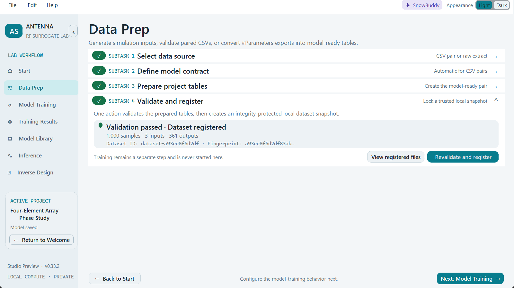
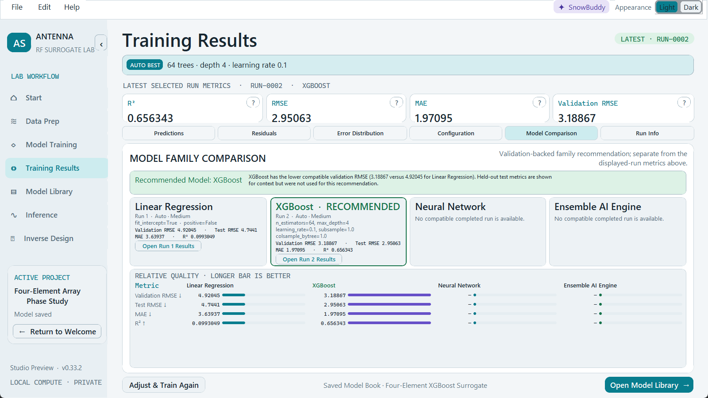
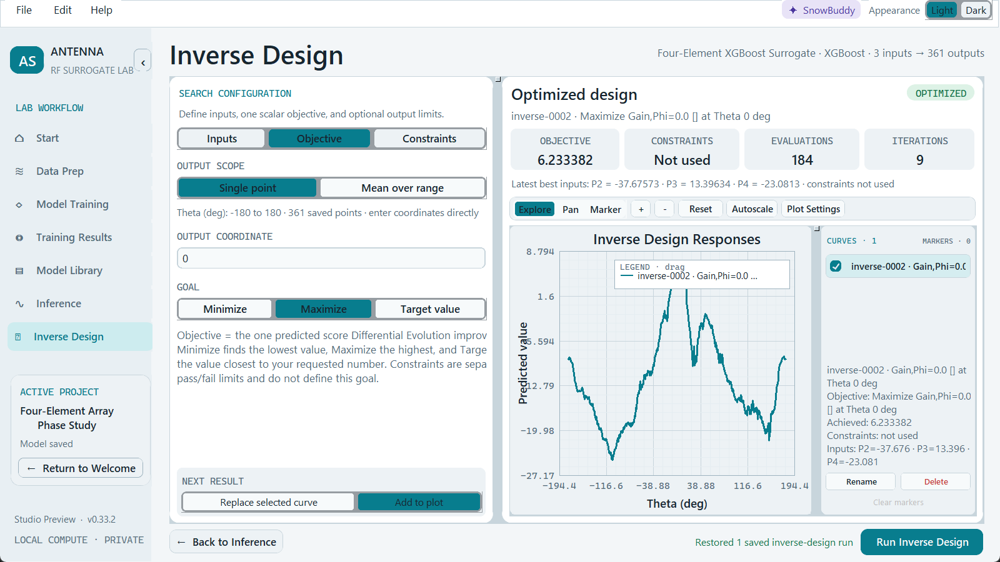
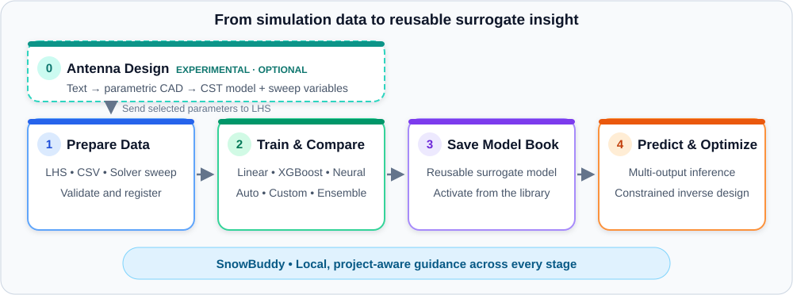
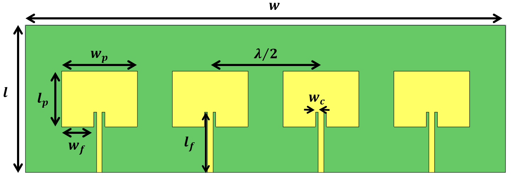

# Antenna Surrogate Studio

Antenna Surrogate Studio is a local desktop application for turning simulation
data into reusable surrogate models, exploring predictions, and running inverse
design studies.

## Data → Surrogate Training → Inverse Design

<table>
  <tr>
    <td width="33%">
      <a href="docs/screenshots/01-data-preparation.png">
        
      </a>
    </td>
    <td width="33%">
      <a href="docs/screenshots/02-model-comparison.png">
        
      </a>
    </td>
    <td width="33%">
      <a href="docs/screenshots/03-inverse-design.png">
        
      </a>
    </td>
  </tr>
  <tr>
    <td align="center"><strong>1 · Prepare and validate data</strong></td>
    <td align="center"><strong>2 · Train and compare surrogates</strong></td>
    <td align="center"><strong>3 · Search and inspect designs</strong></td>
  </tr>
</table>

<p align="center"><em>Shown with the included four-element patch-array phase-sweep sample. Select an image to view it full size.</em></p>

Everything runs on your computer. Your projects, models, results, and SnowBuddy
conversations remain in your local project folders.

## What it does

- Experimental tool-using antenna design agent with patch, circular-patch, dipole, array recipes, and composable rectangular-patch corner cutouts
- Interactive in-app 3D geometry preview and parameterized CST export
- Latin Hypercube sample generation
- Dataset preparation and validation
- Linear Regression, XGBoost, and Neural Network models
- Auto and Custom training
- Ensemble AI Engine
- Model comparison
- Reusable Model Books
- Multi-output inference and scientific plotting
- Surrogate-driven inverse design with constraints



## Install and launch

### Windows 10 or 11

You need a 64-bit installation of Python 3.11, 3.12, or 3.13.

1. [Download the repository as a ZIP](https://github.com/sampreethsharma7/AntennaSurrogateStudio/archive/refs/heads/main.zip) and extract it, or clone the repository.
2. Open the extracted `AntennaSurrogateStudio` folder.
3. Double-click **Start Antenna Surrogate Studio.bat**.

The first launch creates one private `.venv` environment and installs the
required packages. The Studio opens automatically when setup finishes.

For every later launch, double-click **Start Antenna Surrogate Studio.bat**
again. The same environment is reused; you do not need to activate it or create
another one.

### macOS or Linux

You need 64-bit Python 3.11, 3.12, or 3.13. Open a terminal in the repository
folder and run:

```bash
bash start_studio.sh
```

On Linux, install your distribution's Python Tk package first if it is missing
(commonly `python3-tk`).

For command-line setup, troubleshooting, and system requirements, see
[INSTALL.md](INSTALL.md).

## Start your first project

1. Select **Create Project**.
2. On **Design Start**, continue with an existing design or open the experimental antenna design agent.
3. In **Data Prep**, load an input/output CSV pair, parse a supported parameter-sweep export, or receive selected builder parameters in the LHS generator.
4. Select **Validate and register**.
5. Open **Model Training**, choose a model and training mode, then select **Train Model**.
6. Review the completed run in **Training Results**.
7. Select **Create Model Book** to save the trained surrogate for reuse.
8. Make the Model Book active in **Model Library**.
9. Use **Inference** for new predictions or **Inverse Design** to search for suitable inputs.

The experimental agent supports three controlled recipes: an inset-fed
rectangular microstrip patch, a probe-fed circular patch, and a center-fed
dipole. Where valid, each can be replicated into linear or planar arrays. The
rectangular patch also supports four subtractive circular corner cutouts with
their centers on the patch corners and a parametric radius ratio. The
recipes compose a discoverable registry of small geometry and EM tools into one
solver-neutral design graph. The parameter table, interactive preview, CST
adapter, and LHS transfer all read that same validated graph. Every text request
goes to the selected provider/model with the current design and runtime tool
schemas. Local Ollama, Gemini, Groq, and OpenRouter models receive the same planner instructions,
state, tool manifest, and output schema. The model may return only an explicit
sequence of registered planning-tool calls, a clarification, or a refusal. The deterministic executor
still owns recipes, geometry, validation, and CST generation; the model cannot
add tools, geometry types, antenna families, or solver commands. A small
planner-exposed primitive subset can compose validated rectangular and circular
slots from named parameters, cutting geometry, and Boolean operations without a
slot-specific modifier. Validated compositions persist with the project and are
replayed after later recipe-parameter rebuilds using semantic antenna-element
targets. Array elements use independent ports, while feed-network synthesis and
EM verification remain in CST.

For detailed, page-by-page operating instructions, see the
[Antenna Surrogate Studio User Manual](USER_MANUAL.md).
The extension boundary and validation ladder are documented in
[Experimental Antenna Design Agent Architecture](docs/ANTENNA_AGENT_ARCHITECTURE.md).
The controlled four-backend comparison is recorded in the
[Antenna Planner A/B Report](docs/ANTENNA_PLANNER_AB_REPORT.md).
For the complete implementation, antenna-engineering assessment, limitations,
and roadmap, see
[Text-Parametric Builder: Deep Technical and Design Overview](docs/TEXT_PARAMETRIC_BUILDER_DEEP_OVERVIEW.txt).

## Try the included sample

The repository includes a ready-to-use
[four-element patch-array phase-sweep sample](sample_data/four_element_patch_array_phase_sweep/).
It contains 1,000 CST parameter-sweep cases and a 361-point radiation pattern
for each case.



To try it, create a project and choose **#Parameters sweep** in **Data Prep**.
Browse to the sample's `data` folder, select **Parse**, then choose `P2`, `P3`,
and `P4` as the model inputs and `Gain,Phi=0.0 []` as the output. Select
**Save selection**, **Prepare input + output**, and **Validate and register**.

For exact steps and a suggested first training run, open the
[sample guide](sample_data/four_element_patch_array_phase_sweep/README.md).

## Antenna planner backends

SnowBuddy's built-in workflow guidance works without any additional service.
The antenna builder defaults to the **Local Ollama** provider, which requires a
running local [Ollama](https://ollama.com/download) instance. Its Model menu is
populated from the models installed in that instance:

- `qwen3:8b` is the recommended and live-validated antenna-planner model for
  computers with about 16 GB RAM or more.
- `qwen3:1.7b` remains useful for SnowBuddy and simple edits on lower-resource
  computers, but complex multi-tool antenna plans may be refused after strict
  validation.

The builder has separate **Provider** and **Model** menus. It discovers installed
models from local Ollama and current catalogs from **Gemini**, **Groq**, and
**OpenRouter**. Models exercised with the antenna agent are labeled **Tested**;
other compatible text models are labeled **Untested**. Copy
[`.env.example`](.env.example) to an untracked `.env` in the repository root
and set the corresponding `GEMINI_API_KEY`, `GROQ_API_KEY`, or
`OPENROUTER_API_KEY` value. OpenRouter includes a pricing-based **Free only**
filter. `qwen3:8b`, `gemini-3.8-flash`, `openai/gpt-oss-120b`, and
`nvidia/nemotron-3-ultra-550b-a55b:free` carry Tested metadata when their
providers list them. Never commit
`.env`; it is excluded by `.gitignore`. If a cloud key is missing, the builder
reports the setup requirement and Local Ollama remains usable.

Provider/model/filter choice persists with the project. A failed catalog request
retains the last valid model and reports the failure. The selector states when
design context will leave the computer. All models receive the same ToolPlan schema and use the same strict parser,
deterministic executor, repair limits, and validators. Local Ollama also uses that
schema for provider-constrained decoding. Gemini uses JSON response mode because
its API rejects the current exact thirteen-branch ToolPlan union as a response
schema; its output is then parsed and validated against the unchanged schema
before any tool can run. Groq first requests strict JSON Schema output with the
unchanged ToolPlan schema. If the provider rejects that exact strict request,
it retries in JSON-object mode and uses the same local strict parser without
simplifying the schema. The OpenRouter transport does not require provider
`response_format` enforcement, so its selected model receives the same JSON
instruction and schema in the shared context and relies on the same strict
post-generation parser. Each project logs the backend, decoding mode, request,
returned plan, validation, repair, and final executed tool sequence to
`design/planner_ab.jsonl`; credentials are never logged. The parameter table,
preview, validation, and exports remain deterministic. The preview evaluates
the canonical primitive/transform/Boolean graph: inset unions, arbitrary circle
or rectangle slots, edge unions, and arrays change the displayed mesh itself.
It preserves true Z dimensions, draws canonical port endpoints, and explicitly
warns and suppresses inputs if a Boolean cannot be rendered faithfully.

## Projects and privacy

Projects are stored by default in:

```text
Documents/Antenna Surrogate Studio Library/projects/
```

To move a project to another computer, copy the complete project folder. Do not
copy only the model file; the folder also contains the project state, Model
Books, prediction and inverse-design histories, and local SnowBuddy history.

Local Ollama and SnowBuddy keep their design/chat context on this computer. When
the user explicitly selects a cloud planner in the antenna builder, that
instruction, the current antenna design state, and the runtime tool manifest
are sent to Google Gemini, Groq, or OpenRouter for planning. Project files and
CST outputs remain local.

## Help and contact

- Setup help: [INSTALL.md](INSTALL.md)
- User instructions: [USER_MANUAL.md](USER_MANUAL.md)
- Author: **Sai Sampreeth Indharapu**
- Email: [sampreethsharma@gmail.com](mailto:sampreethsharma@gmail.com)
- LinkedIn: [Sai Sampreeth Indharapu, Ph.D.](https://www.linkedin.com/in/sai-sampreeth-indharapu-ph-d-a98802110/)

## Repository policy

This repository is an author-maintained software release. External pull
requests and code contributions are not accepted. For installation help or
tester feedback, contact the author directly.

## License

Antenna Surrogate Studio is licensed under the
[PolyForm Noncommercial License 1.0.0](LICENSE). Noncommercial research,
educational, and personal use are permitted. Commercial use requires separate
permission from the author.
