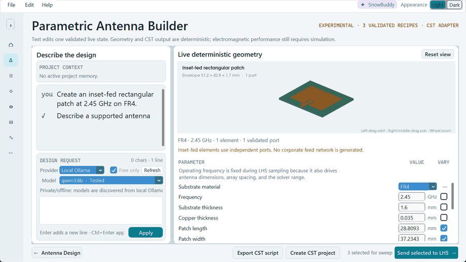
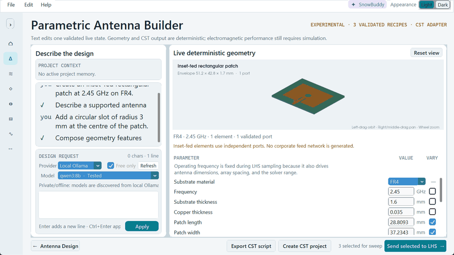
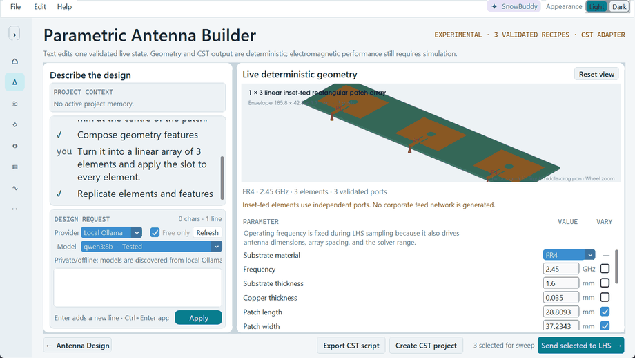
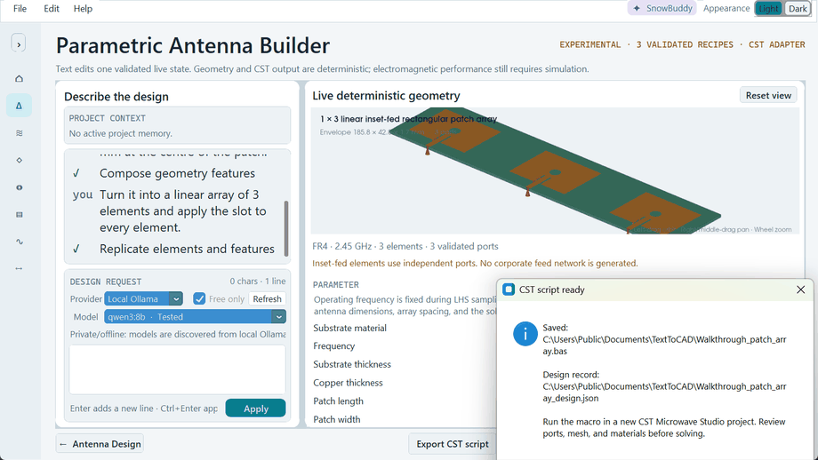
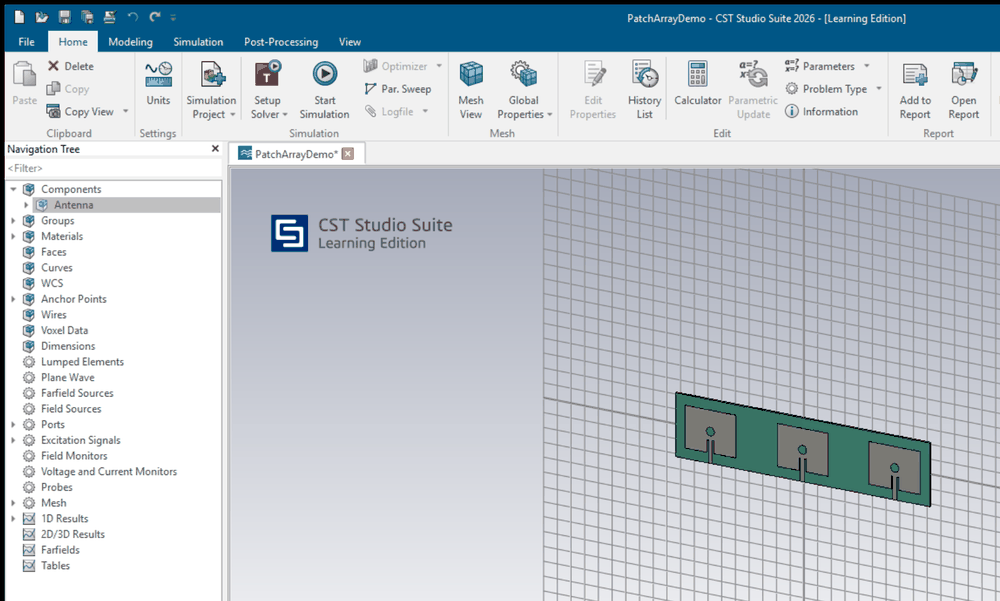

# Text to Antenna CAD

### Describe an antenna in plain language. Get a parametric, editable CST model.

 

<b>Three requests, one model.</b> Patch → slot → array → CST. Full walkthrough, 37 s.

---

## The idea

Setting up a parametric antenna in an EM solver is slow, and most of the time is
spent on construction rather than on engineering. This builder moves the
construction step into language, and keeps everything downstream deterministic.

**plain language** → **validated parametric design** → **CST model + sweep variables** → **surrogate**

The language model never writes CAD or solver code. It may only choose from a
registry of schema-checked tools. A deterministic executor owns geometry,
validation and export — so the same request always produces the same model, and
an unsupported request is refused instead of approximated.

---

## What you can do

<table>
<tr>
<td width="50%" valign="top">

**1 · Start from a sentence**

> *Create an inset-fed rectangular patch at 2.45 GHz on FR4*

Analytical starting dimensions, a validated port, and a live parameter table.

</td>
<td width="50%" valign="top">

**2 · Edit it compositionally**

> *Add a circular slot of radius 3 mm at the centre of the patch*

No slot-specific feature exists. The slot is composed from primitives and
Boolean operations, and becomes part of the design.

</td>
</tr>
<tr>
<td width="50%" valign="top">

**3 · Replicate into an array**

> *Turn it into a linear array of 3 elements and apply the slot to every element*

Three elements, three independent validated ports — and the slot is carried onto
each one, not just the first.

</td>
<td width="50%" valign="top">

**4 · Export to CST**

A parameterised construction macro plus the paired design JSON — or a native
`.cst` project written directly.

</td>
</tr>
</table>

> **Edits survive each other.** Change the frequency after cutting the slot and
> the patch resizes, then the slot is replayed onto the new geometry against a
> semantic element target. If a replay is no longer geometrically valid, the edit
> is rejected and your last working design stays open.

---

## …and into CST

The real generated project in CST Studio Suite 2026. The solids are <b>native CST objects</b>, not an imported mesh, so the model stays editable and parametric.

Parameters arrive with meaningful names — `FreqGHz`, `PatchL`, `PatchW`,
`ElementSpacing` — so a sweep set up in CST, or a Latin Hypercube table
generated in the Studio, refers to the same quantities you were just talking
about.

**No solver is ever started.** The export selects the HF Time Domain solver and
stops.

---

## Starting points

Every design begins from one of three validated recipes. This is the current
construction boundary, and it is deliberate.

| Recipe | Arrays | Notes |
| --- | :---: | --- |
| Inset-fed rectangular microstrip patch | ✅ | Also accepts four subtractive circular corner cutouts with a parametric radius ratio |
| Probe-fed circular patch | ✅ | Coaxial probe launch |
| Centre-fed dipole | ✅ | |

Substrates: **FR4**, **Rogers RO4003C**, **Rogers RT5880**, with constant
dielectric properties.

<b>The full tool registry — what the planner may call</b>

 

With a design open the planner may call **19 registered tools** and nothing
else. It cannot add tools, geometry types, antenna families, materials or solver
commands.

| Group | Tools |
| --- | --- |
| Recipe & modifier actions (6) | `design.reset`, `recipe.select`, `parameter.set`, `excitation.set_strategy`, `modifier.apply`, `modifier.remove` |
| Composition primitives (9) | `parameter.create`, `geometry.rectangle_sheet`, `geometry.cylinder`, `geometry.circle_sheet`, `geometry.translate`, `geometry.rotate`, `geometry.duplicate`, `boolean.subtract`, `boolean.union` |
| Read-only analysis (4) | `engineering.design_summary`, `engineering.array_spacing`, `engineering.rectangular_patch_baseline`, `engineering.dipole_baseline` |

The model's only permitted replies are an ordered sequence of those calls, one
clarification question, or a refusal. Every plan is schema-checked, then
validated for object references, bounds, dependencies and whole-design validity
before anything is published.

Details: [Agent Architecture](docs/ANTENNA_AGENT_ARCHITECTURE.md) ·
[Engineering Analysis Reference](docs/ENGINEERING_ANALYSIS_REFERENCE.md)

<b>Engineering inspection — what it will tell you unprompted</b>

 

Four read-only tools measure the design you have and compare it with
conventional first-order references. They never change geometry and never
recommend a change.

- **Rectangular patch baseline** — conventional width, effective permittivity,
  fringing extension and length, against your current dimensions.
- **Dipole electrical length** — measured arm lengths, feed gap and conductor
  radius, as λ₀ ratios against half-wave and quarter-wave references.
- **Array spacing** — row and column spacing in free-space wavelengths, and
  optionally the visible integer spatial orders for a scan angle.
- **Design summary** — the canonical inventory.

A radiator carrying slots or other composed geometry is flagged as a modified
topology, and its baseline is marked reference-only rather than quietly
reported as if the simple formula still applied.

Every equation and worked number is in the
[Engineering Analysis Reference](docs/ENGINEERING_ANALYSIS_REFERENCE.md).

<b>Sweep variables → surrogate modelling</b>

 

Tick **Vary** on the parameters you care about and send them to the Latin
Hypercube generator, which produces the sample table you simulate. Feed the
results back into Data Prep and the rest of the Studio trains a surrogate on
them.

One deliberate guard: for arrays, `SpacingMode` decides whether element spacing
is held electrically (`lambda`) or physically (`fixed_mm`). In `lambda` mode
frequency is **not** offered as a sweep variable, because moving it would move
the geometry too and confound the surrogate. Switch to `fixed_mm` and frequency
becomes sweepable as a pure operating point.

---

## What this is **not**

Being precise about this matters more than making the feature sound bigger.

| | |
| --- | --- |
| ❌ **Not free-form text-to-CAD** | It will not invent an antenna topology from a description. Every design starts from one of the three recipes above. |
| ❌ **Not an optimiser** | Nothing searches a design space or tunes toward a target. You decide what to change. |
| ❌ **Not autonomous synthesis** | The model proposes registered tool calls; a deterministic executor validates and applies them. It acts on your instruction, one turn at a time. |
| ❌ **Not an EM result** | Analytical dimensions and the 3D preview are design aids. Nothing here solves Maxwell's equations. |
| ❌ **Not verified geometry** | **Inspect the materials, feeds, ports, boundaries and mesh, then simulate.** Matching an analytical baseline establishes neither resonance nor match, gain, bandwidth, efficiency or pattern validity. |

Exported models also carry no field or farfield monitors, array row and column
counts are structural in CST, and conductors export as PEC. The full list is in
[Current limitations](docs/LIMITATIONS.md) — worth five minutes before your
first export.

<b>About the walkthrough above:</b> it is a scripted state-by-state capture of the
real application, not a screen recording, so there is no mouse cursor and the
typing cadence is synthetic. The geometry, parameter values, port counts and the
export dialog are all genuine. <b>Planner latency is not represented</b> — a live
run pauses for real seconds at each Apply. The CST frames were captured on a
Learning Edition licence.

---

## Where this is going

Today the recipe is the construction boundary: it decides which antennas are
reachable at all. The intended direction is to invert that — recipes become
optional starting templates, and a library of reusable CAD and EM tools becomes
the real boundary.

That architecture **does not exist yet**, and the sketch is honest about what
would have to be true first.

**[Read the Future Direction →](docs/FUTURE_DIRECTION.md)**

---

### Try it

**[Install](INSTALL.md)** · **[User Manual](USER_MANUAL.md)** ·
**[Current limitations](docs/LIMITATIONS.md)** · **[Back to the README](README.md)**

Part of <a href="README.md">Antenna Surrogate Studio</a> — source-available for noncommercial use.

