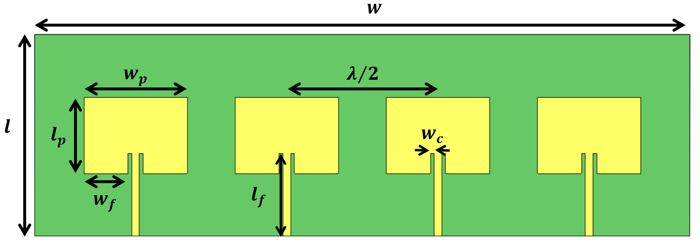

# Four-Element Patch-Array Phase-Sweep Sample



This ready-to-use example helps you complete your first Antenna Surrogate
Studio project with a real parameter-sweep export.

## Dataset at a glance

| Item | Included data |
| --- | --- |
| Antenna | Four-element microstrip patch array simulated in CST Microwave Studio |
| Samples | 1,000 phase configurations, split across two raw export files in `data/` |
| Model inputs | `P2`, `P3`, `P4` |
| Fixed reference | `P1 = 0 deg` |
| Input range | Approximately `-180 deg` to `180 deg` |
| Model output | `Gain,Phi=0.0 []` |
| Output coordinates | Theta `-180 deg` to `180 deg` in `1 deg` steps |
| Outputs per sample | 361 |

Latin Hypercube Sampling was used to distribute the phase combinations across
the input range. The original dataset description is available in
[`dataset_description.txt`](dataset_description.txt).

## Folder layout

```text
four_element_patch_array_phase_sweep/
├── data/                         Raw files selected in Data Prep
│   ├── parasweep_phases_output.txt
│   └── parasweep_phases_batch2_output.txt
├── PatchAntennaArray.png         Reference image
├── dataset_description.txt      Dataset notes
└── README.md                     This guide
```

Keeping raw exports in their own data folder prevents documentation and images
from being mixed with simulation files. The same practice is recommended for
future projects.

## Load the sample in the Studio

1. Launch Antenna Surrogate Studio and select **Create Project**.
2. Open **Data Prep** and expand the **Source** subtask.
3. Select **#Parameters sweep**.
4. Select **Browse folder** and choose the sample's
   `four_element_patch_array_phase_sweep/data` folder.
5. Select **Parse**. The Studio should report **1,000 samples**.
6. Under **Model inputs**, select only `P2`, `P3`, and `P4`.
7. Under **Model output**, select `Gain,Phi=0.0 []`.
8. Select **Save selection**, followed by **Prepare input + output**.
9. Open the validation subtask and select **Validate and register**.
10. Continue to **Model Training**.

Select the whole `data` folder rather than one text file. Each raw export
contains 500 samples, and the Studio combines both files into the full
1,000-sample dataset.

The parser also discovers fixed CST settings. Do not select those settings as
model inputs for this example. `P1` is the fixed phase reference, so the three
varying phases are the appropriate model inputs.

## Suggested first training run

For a quick first experience:

1. Choose **Linear Regression**.
2. Keep **Auto** mode and **Medium** search level.
3. Select **Train Model**.
4. Review the predicted and actual radiation-pattern curves in
   **Training Results**.
5. Select **Create Model Book**, make the book active in **Model Library**, and
   try a new phase combination in **Inference**.

This sample is provided to demonstrate the workflow. It is not intended as a
universal antenna benchmark or a claim about performance on other designs.
